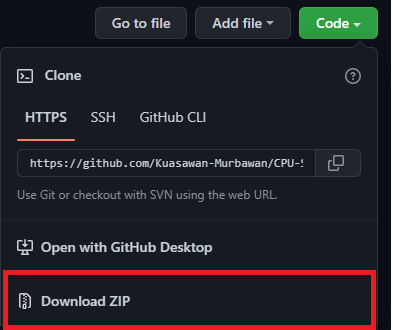

# Scheduling Algorithm
### CSCI 3300 | Operating System

## Prepared By

---

| Name | Matric No.|
| -----| :---:|
|[MUHAMMAD AFIQ HUSYAIRI BIN MOHAMAD FADZLI](https://www.linkedin.com/in/afiqhusyairi)|2018769|
|MUHAMMAD AFIQ BIN KHARUL AZMAN|2011595|
|MUHAMMAD AIMAN BIN MAT ISA|2014243|
|WAN MUHAMMAD IRFAN BIN WAN ZAIDI|2015321|

## How to access

1. Go to this link  
[https://github.com/Kuasawan-Murbawan/CPU-Scheduling-Comparison](https://github.com/Kuasawan-Murbawan/CPU-Scheduling-Algorithm)
2. Click Code  

3. Download ZIP
4. Unzip file
5. Run "main.exe"
6. Follow the instructions
7. Enjoy
